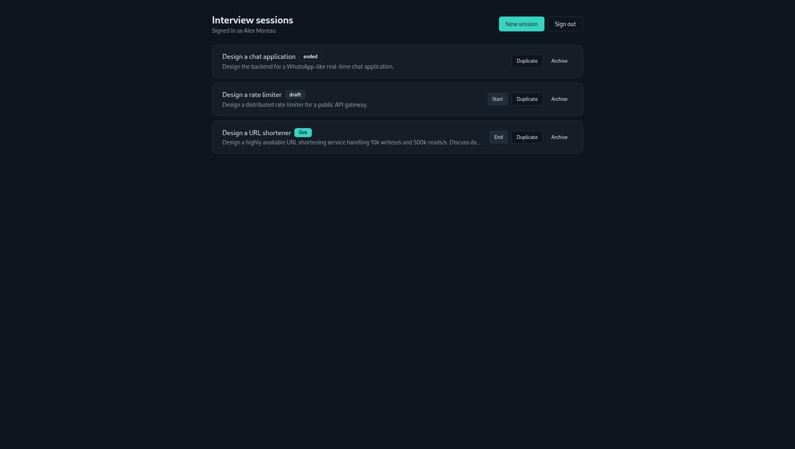
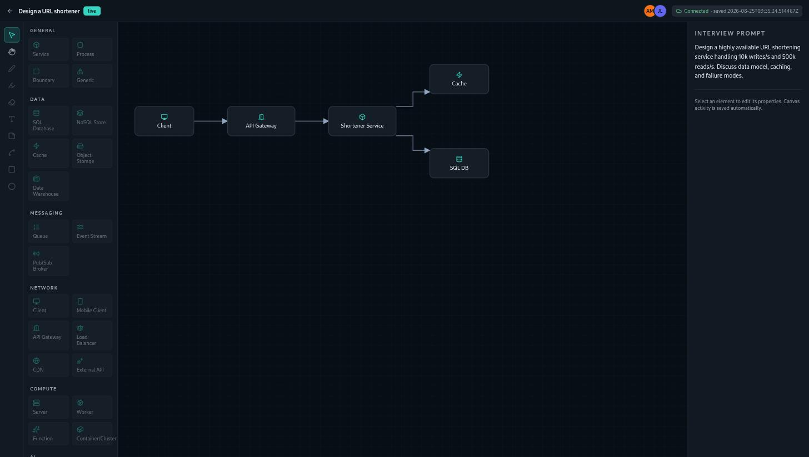
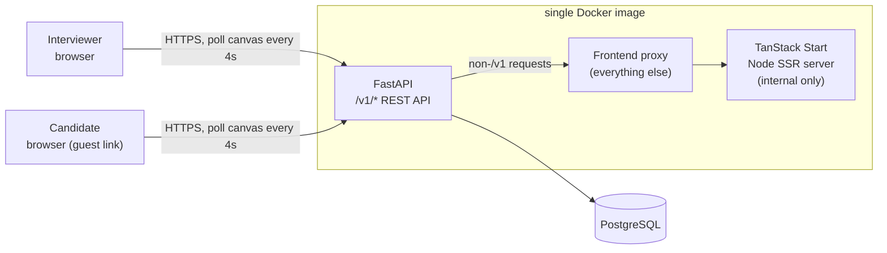

# Canvas Connect

[](https://github.com/bergimax/canvas-connect/actions/workflows/ci-cd.yml)

Canvas Connect is a real-time collaborative whiteboard for running system-design interviews. An interviewer creates a session, shares a link, and a candidate joins and sketches an architecture together with them on a shared canvas — services, databases, queues, connectors, sticky notes, freehand strokes — while both sides see each other's edits and cursors.

Full product specification: [docs/specs.md](docs/specs.md).

## Table of contents

- [The problem](#the-problem)
- [Demo](#demo)
- [Quickstart](#quickstart)
- [Testing](#testing)
- [Configuration](#configuration)
- [Observability](#observability)
- [Deployment](#deployment)
- [Architecture](#architecture)
- [Project structure](#project-structure)
- [Decisions and trade-offs](#decisions-and-trade-offs)
- [CI/CD](#cicd)
- [Limitations](#limitations)
- [Future work](#future-work)
- [License](#license)

## The problem

Whiteboarding is central to a system-design interview, but the usual options are awkward for it:

- General-purpose whiteboard tools (Miro, Excalidraw, a physical whiteboard over screen share) work, but have no concept of an interviewer/candidate session, a shareable one-time invite link, or locking editing when the interviewer wants to take back control.
- Ad-hoc solutions mean re-explaining the tool to every candidate and losing the session state once the call ends — there's nothing to reopen and review afterwards.

Canvas Connect is scoped specifically to this workflow: an interviewer manages sessions from a dashboard, generates a revocable candidate link per interview, and the canvas — plus a purpose-built palette of system-design components (services, databases, queues, load balancers, caches, LLMs, ...) — is saved automatically and reopenable after the interview ends.

## Demo

**Interviewer dashboard** — sessions in `draft`, `live`, and `ended` states, each with its own controls:



**Shared canvas** — component palette on the left, the interview prompt on the right, live participant presence and save status in the top bar:



Typical flow: the interviewer signs in, opens or creates a session, and shares its candidate link. The candidate opens the link, enters a display name, and lands on the same canvas. Both sides place and connect components, draw freehand, and see each other's changes converge within a few seconds (see [Architecture](#architecture) for how sync actually works). [`e2e/tests/interviewer-candidate-collaboration.spec.ts`](e2e/tests/interviewer-candidate-collaboration.spec.ts) drives this exact flow against real browsers and a real backend, and is the closest thing to a live demo you can run yourself — see [Testing](#testing).

There's no public deployment yet (see [Deployment](#deployment)), but the whole stack runs locally with one command — see [Quickstart](#quickstart).

## Quickstart

Requires Docker and Docker Compose.

```bash
git clone https://github.com/bergimax/canvas-connect.git
cd canvas-connect
docker compose up -d --build
```

Open http://localhost:8000 and sign in with the seeded demo account: `interviewer@example.com` / `password123` (shown on the login screen itself, so this isn't a secret you need to remember).

> **Troubleshooting:** if `docker compose ... --build` fails with `compose build requires buildx 0.17.0 or later`, your Docker CLI's buildx plugin predates Compose's build integration. Build the image directly instead — `docker build -t canvas-connect:local .` — then `docker compose up -d` (no `--build`) will use it.

The single container serves both the API and the built frontend on the same origin (see [Architecture](#architecture)), backed by a Postgres container with a named volume — nothing is written outside Docker's own storage.

### Local development (without Docker)

Faster iteration loop: backend on SQLite with autoreload, frontend on Vite with HMR.

```bash
make install   # uv sync (backend) + npm install (frontend)
make dev       # backend on :8000, frontend on :8080, Ctrl+C stops both
```

`frontend/.env.local` already points the dev frontend at the dev backend's port, so the defaults line up. Run `make help` for the full list of targets (backend/frontend individually, linting, each test suite).

## Testing

There's no ML model here to evaluate, but the same "show your work" principle applies — this section is the evidence that the application behaves as documented, not just that it renders something.

| Suite | What it covers | Command |
| --- | --- | --- |
| Backend unit (43 tests) | Auth, sessions, guest links, join flow, canvas save/load, participants, `/health` — in-process against SQLite, no I/O | `make test` |
| Backend integration (7 tests) | The same flows against the *real* `docker-compose.yml` stack — real Postgres, real foreign-key enforcement, the frontend reverse proxy, data surviving a container restart | `make test-integration` |
| Frontend unit (7 tests) | The two pure/testable `lib` modules: class-name merging (`cn`) and bearer-token storage | `make test-frontend` |
| Frontend typecheck + lint | `tsc --noEmit` + ESLint (Prettier, react-hooks, react-refresh rules) | `make lint` |
| End-to-end (1 test) | The full interviewer → guest link → candidate join → concurrent edit → convergence flow, driven by Playwright against two real, isolated browser contexts and the real Compose stack | `make test-e2e` |

`make test-integration` and `make test-e2e` each manage the Docker Compose stack's lifecycle themselves (clean `down -v`, `up --wait`, then `down -v` again on exit), so they're safe to run repeatedly without leftover state — the only requirement is Docker.

All five run in CI on every push and pull request against `main`; see [CI/CD](#cicd).

## Configuration

The app runs with zero configuration out of the box (SQLite file, mock auth seed data). These environment variables let you point it elsewhere:

| Variable | Used by | Default | Purpose |
| --- | --- | --- | --- |
| `DATABASE_URL` | backend | `sqlite:///./canvas_connect.db` | Any SQLAlchemy URL; `docker-compose.yml` sets it to the Postgres container |
| `FRONTEND_BASE_URL` | backend | `http://localhost:8080` | Origin used when building candidate guest-link URLs |
| `APP_IMAGE` | `docker-compose.yml` | `canvas-connect:local` | Overridden by the deploy pipeline to run the exact image CI built and tested, instead of rebuilding — see [CI/CD](#cicd) |
| `ENVIRONMENT` | backend | `local` | Tags every OpenTelemetry span (`deployment.environment.name`); set to `dev`/`prod` by the deploy pipeline — see [Observability](#observability) |
| `APP_VERSION` | backend | `dev` | Tags every span (`service.version`) with the deployed image tag; set by `deploy/deploy.sh` |
| `OTEL_EXPORTER_OTLP_ENDPOINT` | backend | unset | Where traces are exported (OTLP/HTTP); traces are created but not exported if unset — see [Observability](#observability) |
| `OTEL_SERVICE_NAME` | backend | `canvas-connect-backend` | Overrides the `service.name` span attribute |
| `VITE_API_BASE_URL` | frontend (dev only) | unset | Points the Vite dev server at a backend; unset means same-origin |
| `VITE_USE_MOCK_API` | frontend (dev only) | `true` unless a base URL is set | Forces the in-memory mock backend (`frontend/src/lib/mock-backend.ts`) on or off |

`docker-compose.prod.yml` (the production override, see [Deployment](#deployment)) additionally reads `DB_PASSWORD`, `SITE_ADDRESS`, and `FRONTEND_BASE_URL` from a `.env` file next to it — all required, none have defaults, since it's meant to run on a real host, not a laptop. Copy [`.env.example`](.env.example) to `.env` and fill it in; not needed for the plain `docker-compose.yml` quickstart above.

## Observability

The backend is instrumented with [OpenTelemetry](https://opentelemetry.io/) (`backend/app/telemetry.py`): every request (FastAPI) and database query (SQLAlchemy) produces a trace, tagged with three resource attributes so a trace backend can filter/group by exactly what's running —

- `service.name` — `canvas-connect-backend` (override with `OTEL_SERVICE_NAME`)
- `deployment.environment.name` — `local`/`dev`/`prod`, from `ENVIRONMENT`
- `service.version` — the deployed image tag, from `APP_VERSION`

Traces are always created but only exported when `OTEL_EXPORTER_OTLP_ENDPOINT` is set (OTLP/HTTP), so local dev and the test suite don't spend every request retrying a connection to a collector that isn't running. Point it at any OTLP-compatible collector to start seeing traces.

The same resource attributes tag four application metrics, all defined in `backend/app/telemetry.py` and recorded at the point in `app/store.py`/`app/routers/canvas.py` that each one actually happens:

| Metric | Kind | Recorded when |
| --- | --- | --- |
| `canvas_connect.interview_rooms.created` | counter | a session is created or duplicated |
| `canvas_connect.interview_participants.active` | up/down counter | a participant joins/is added, or is removed |
| `canvas_connect.canvas_elements.created` | counter | a canvas save introduces element ids not seen before |
| `canvas_connect.component_creation.failures` | counter | a canvas save is rejected (forbidden role, disabled editing) or errors, tagged with `reason` |

The same resource attributes also tag application logs: the `canvas_connect` logger (`get_logger()` in `backend/app/telemetry.py`) writes to stdout always, and via OTLP whenever a collector's configured — trace-correlated automatically, since every record emitted inside a request span carries that span's `trace_id`/`span_id`. `app/store.py`/`app/routers/canvas.py` log the same lifecycle events and failures the metrics above count.

One alert is provisioned: **repeated canvas component-creation failures** — 3+ actual failures (`reason="error"`, not the expected observer/candidate-editing-disabled rejections) within 5 minutes, sustained 2 minutes, fires once per `(environment, version)` independently. See [`observability/README.md#alerting`](observability/README.md#alerting) for the full reasoning and what's in the alert (service, environment, version, owner, dashboard link).

[`on-call-engineer/`](on-call-engineer/) polls Grafana's alert API every minute and, when an alert fires, hands its details to a headless coding agent (`claude -p --restricted`, no ability to act — investigation only) for a first-pass triage report before a human ever looks at it — see its README for how it works and what's been verified.

A local collector plus a place to view what it collects is included: [`observability/`](observability/) runs OpenTelemetry Collector + Prometheus + Loki + Tempo + Grafana as its own Compose project, with a pre-provisioned Grafana dashboard for the four metrics and the logs above, filterable by environment and version — see [`observability/README.md`](observability/README.md) for how to run it and connect the app stack to it.

## Deployment

**Not publicly deployed yet.** The pipeline and infrastructure-as-code are both written and tested end-to-end (see below), but no AWS account has been wired up. This section documents what happens the moment it is.

**Two independent environments**, dev and prod, each its own complete copy of the infrastructure — separate EC2 instance, ECR repository, security group, and Elastic IP, distinguished by `deploy/cloudformation.yml`'s `Environment` parameter (`dev` / `prod`). They share nothing: creating, updating, or deleting one stack never touches the other. Deploy both by running the same template twice with different `Environment` values and stack names (e.g. `canvas-connect-dev`, `canvas-connect-prod`).

- **Where**: one EC2 instance per environment, running the same `docker-compose.yml` + `docker-compose.prod.yml` stack as local dev, plus Caddy as a reverse proxy for automatic HTTPS once a domain is set. Access is via SSM Session Manager only — no SSH port is open. The instance never builds an image itself, at boot or otherwise — see [Decisions and trade-offs](#decisions-and-trade-offs).
- **Build stage, once**: `.github/workflows/ci-cd.yml`'s `build` job builds the app image exactly once, after every test suite passes, and pushes it to **both** environments' ECR repositories, tagged `YYYYMMDD-HHMMSS-<short sha>` (e.g. `20260818-163457-83242da`) plus a rolling `latest` — so any commit on `main` is immediately promotable to production later without a rebuild.
- **Deploy stage, pull-only, per environment**:
  - **dev** auto-deploys on every push to `main` (`deploy-dev` job) — talks to the dev instance over SSM (`deploy/deploy.sh ENVIRONMENT=dev`) and asks it to pull that exact tag and restart the stack. Never builds anything.
  - **prod** is a manual promotion — a separate workflow, [`.github/workflows/promote-to-production.yml`](.github/workflows/promote-to-production.yml), run from the Actions tab ("Promote to Production" → "Run workflow"). By default it promotes whatever tag is **currently deployed in dev** (read from dev's last-known-good SSM parameter) — no commit/tag picking required, though the optional `tag` input can override that. Gated by a required-reviewer rule on the `production` GitHub Environment, so someone has to approve before it runs.
- **How it's verified**: the same script polls the app's `/health` endpoint (which checks the database connection, not just that a process is listening) after every deploy, and **automatically rolls back** to the last known-good tag (tracked per-environment in SSM Parameter Store) if the health check fails.

To actually turn this on: deploy `deploy/cloudformation.yml` twice — once with `Environment=dev`, once with `Environment=prod` — to an AWS account, then configure two GitHub Environments, `development` and `production`, each with its own `AWS_ROLE_ARN` secret and `AWS_REGION` / `DEPLOY_HEALTH_URL` variables (OIDC roles, so no long-lived AWS keys ever touch GitHub — the exact trust policy and IAM permissions needed are documented as comments above the `deploy-dev` job in `ci-cd.yml` and the single job in `promote-to-production.yml`), plus a required-reviewer protection rule on `production`. There's also one repo-level secret/variable pair (`AWS_ROLE_ARN` + `AWS_REGION`) for the CI build role that pushes to both ECR repos. Every subsequent push to `main` deploys dev automatically; promoting to prod is always an explicit, approved step run from a separate workflow. Until all of that is set, `ci-cd.yml`'s AWS-dependent jobs no-op cleanly instead of failing, and `promote-to-production.yml` fails fast with a clear error if run before its secrets/variables are set.

### Observability stack

The observability stack (`observability/`, see [Observability](#observability)) deploys the same way, but as a **third, independent stack** — [`deploy/observability-cloudformation.yml`](deploy/observability-cloudformation.yml) — not duplicated per app environment. There's exactly one instance running the collector/Prometheus/Loki/Tempo/Grafana, and both dev and prod point at it.

- **Where**: one EC2 instance, running `observability/docker-compose.yml` + `observability/docker-compose.prod.yml` (Caddy in front of Grafana, same automatic-HTTPS pattern as the app). No ECR here — the images are public, pinned tags already versioned in `observability/docker-compose.yml`, so a deploy is just "pull that git config + those pinned tags and restart" ([`deploy/deploy-observability.sh`](deploy/deploy-observability.sh)), not a build/promote pipeline. Same SSM-only access as the app.
- **OTLP ingress is allow-listed, not open to the internet**: the instance's security group only lets ports 4317/4318 through from the dev and prod instances' specific `/32` IPs (`DevInstanceIp`/`ProdInstanceIp` template parameters) — an unauthenticated telemetry-ingestion endpoint on the open internet would be a real risk. Grafana itself is reachable on 80/443 (via Caddy) from anywhere, behind a real admin password (`GrafanaAdminPassword` parameter, not the `docker-compose.yml` dev default).
- **Deploy**: [`.github/workflows/deploy-observability.yml`](.github/workflows/deploy-observability.yml) — runs on every push to `main` that touches `observability/` or the observability CFN template, plus manual dispatch. No dev/prod split; gated by one `observability` GitHub Environment (`AWS_ROLE_ARN` secret, `AWS_REGION` / `DEPLOY_HEALTH_URL` variables, same pattern as above).

**Connecting dev/prod to it** happens through `deploy/cloudformation.yml`'s `ObservabilityOtlpEndpoint` parameter (default empty = no telemetry export, same as local dev), which gets written into each app instance's `.env` at boot and read by `docker-compose.prod.yml`. Because `.env` is only written at boot (not on every `deploy.sh` redeploy — same as `DB_PASSWORD`/`SITE_ADDRESS` today), the practical order is: deploy the observability stack first, note its `PublicIp` output, then deploy/replace the dev and prod instances with `ObservabilityOtlpEndpoint=http://<that-ip>:4318` — and feed dev's and prod's own `PublicIp` outputs back into the observability stack's `DevInstanceIp`/`ProdInstanceIp` parameters so its security group actually lets them through.

## Architecture



- **One process, one exposed port.** The Dockerfile builds the frontend (TanStack Start / Vite, Node SSR target) in one stage and copies the output into the FastAPI image. At runtime, FastAPI serves `/v1/*` directly and reverse-proxies everything else to an internal Node process it starts (`backend/docker-entrypoint.sh`, `backend/app/frontend_proxy.py`) — the browser only ever talks to one origin. The API itself still runs permissive CORS middleware (`allow_origins=["*"]`) for local dev, where the Vite dev server and the backend run on different ports.
- **Persistence** is SQLAlchemy against either SQLite (zero-config local/dev/CI) or Postgres (`docker-compose.yml`, production), with a `UTCDateTime` type that normalizes both backends' different timezone handling — same schema, same code, either database.
- **Collaboration is REST + polling, not WebSocket/CRDT.** [`docs/specs.md`](docs/specs.md) specifies a WebSocket gateway with an operation-based CRDT for the eventual production version; what's actually implemented is simpler: the canvas is `GET`/`PUT` as one whole document (`/v1/sessions/{id}/canvas`), and the frontend refetches it every 4 seconds (`frontend/src/routes/sessions/$id.tsx`) plus on its own debounced autosave after local edits. It's last-write-wins, not conflict-free, and updates take up to ~4 seconds to appear on other screens — worth knowing before reading the code expecting a WebSocket gateway that isn't there. See [Limitations](#limitations).
- **Auth** is bearer tokens, not cookies: interviewers get a `user` token from `POST /v1/auth/login` (email + bcrypt-hashed password; the OpenAPI-documented magic-link endpoint always reports success but never actually issues a token — no email provider is wired up), guests get a `participant` token from `POST /v1/join/{token}`. Every session/canvas/participant endpoint re-checks role and membership server-side on every call.
- **Full REST contract**: [openapi.yaml](openapi.yaml).

## Project structure

```
backend/
  app/
    routers/        # auth, sessions, guest_links, join, canvas, participants, health
    store.py         # all persistence + business logic (SQLAlchemy)
    models.py         # Pydantic request/response + ORM row models
    frontend_proxy.py  # forwards non-/v1 requests to the built frontend
  tests/              # in-process unit tests (SQLite)
  tests_integration/  # same flows against the real docker-compose.yml stack
frontend/
  src/
    routes/          # login, dashboard, join/$token, sessions/$id (the canvas)
    components/canvas/ # Toolbar, PalettePanel, CanvasStage, PropertiesPanel
    hooks/useCanvasEngine.ts  # element CRUD, undo/redo, selection
    lib/              # api client, auth (token storage), realtime client, mock backend
e2e/
  tests/              # Playwright, against the real compose stack
deploy/
  cloudformation.yml  # EC2 instance + ECR repo + IAM roles, parameterized by Environment (dev/prod)
  deploy.sh            # what the deploy CI jobs run over SSM (ENVIRONMENT=dev|prod)
  Caddyfile             # reverse proxy config for the production override
docker-compose.yml       # app + Postgres (dev and CI)
docker-compose.prod.yml  # + Caddy, real secrets (production override)
Dockerfile                # multi-stage: build frontend, then the backend+frontend image
openapi.yaml               # REST contract
docs/specs.md               # full product & technical specification
```

## Decisions and trade-offs

- **One Docker image instead of separate frontend/backend services.** The frontend is a static build plus a thin Node SSR server; running it behind FastAPI as an internal-only process means one port, one health check, one thing to deploy, at the cost of a slightly unusual Dockerfile (two build stages, one runtime `ENTRYPOINT` that starts both processes). For a project this size, the operational simplicity won.
- **Polling instead of a WebSocket/CRDT gateway** (see [Architecture](#architecture)). The original spec calls for one; building a correct operation-based CRDT gateway is a project in its own right, and a 4-second poll plus debounced autosave gets the same *demonstrated* behavior — two people seeing each other's edits — for a fraction of the implementation and testing surface. The cost is real: it's last-write-wins under concurrent edits to the same element, and 4 seconds of latency isn't "real-time" by the spec's own p95 target. Tracked honestly in [Limitations](#limitations) rather than left for a reader to discover by surprise.
- **SQLite for dev/tests, Postgres for the compose stack and production**, same schema and code either way. `get_engine()` special-cases only connection pooling (`StaticPool` for in-memory SQLite so a single shared connection serves all sessions in a test; `pool_pre_ping` for Postgres so a server-closed idle connection surfaces as a retry, not a query failure) — no per-backend SQL, so integration tests against real Postgres are the real coverage for anything unit tests against SQLite structurally can't catch (foreign-key enforcement, real timezone behavior).
- **A single EC2 instance behind Caddy per environment, not a managed container platform.** No ECS/EKS cluster, no load balancer, no auto-scaling — a $15/month box per environment that CI redeploys by SSM and a health-check-gated rollback (see [Deployment](#deployment)). Right-sized for a project with no production traffic yet; the ECR-based deploy path means moving to ECS/Fargate later is mostly a matter of pointing a different compute layer at the same image, not re-architecting the pipeline.
- **Two independent CloudFormation stacks (dev/prod) instead of one shared environment.** Same template, one `Environment` parameter — full isolation (compute, registry, network, rollback state) at the cost of running (and paying for) two boxes instead of one. Dev auto-deploys every push to `main`; prod only moves on an explicit, approved promotion, so `main` can stay deployable without every commit being production-live.
- **Build once, deploy everywhere by pulling — never building on a target.** The build stage (`ci-cd.yml`'s `build` job) is the only place an image gets built; every deploy path after that — dev's auto-deploy, a manual prod promotion, even a brand-new instance's first boot (`deploy/cloudformation.yml`'s UserData) — only ever pulls an already-built, already-tagged image from ECR. No server ever runs `npm ci`/`vite build`/`docker build`, so what's running anywhere is always bit-for-bit what CI tested, and a fresh EC2 instance never needs the extra memory/time a from-source build would cost it.
- **Bearer tokens over cookies.** Guests join without an account, from a link that may be opened in an entirely different browser context than the interviewer's — there's no shared cookie jar to rely on, and a bearer token is one value that works identically for both the REST calls and (per the original spec) the eventual WebSocket handshake.

## CI/CD

`.github/workflows/ci-cd.yml`, on every push and pull request to `main`:

1. **`backend-tests`** and **`frontend-tests`** run in parallel — no dependency between them, so GitHub Actions schedules them concurrently. Backend: `make test` (in-process, SQLite). Frontend: `make test-frontend`, `make lint` (typecheck + ESLint), and a production build.
2. **`integration-and-e2e`** runs after both pass: builds the real `docker-compose.yml` stack and runs `make test-integration` then `make test-e2e` against it, on the same runner so the image only builds once. Uploads the Playwright HTML report as an artifact on failure.
3. **Build stage — `build`** (push to `main` only, after step 2 passes): builds the app image exactly once, tags it `YYYYMMDD-HHMMSS-<short sha>` plus `latest`, and pushes both tags to the dev and prod ECR repositories — see [Deployment](#deployment).
4. **Deploy stage — `deploy-dev`**: pulls that exact tag (never builds) and redeploys the dev EC2 instance to it over SSM, health-checks it, and rolls back automatically on failure.

Promoting to production is a separate workflow, [`.github/workflows/promote-to-production.yml`](.github/workflows/promote-to-production.yml) — manual `workflow_dispatch` only (Actions tab → "Promote to Production" → "Run workflow"). By default it pulls whatever tag is *currently deployed in dev* (read from dev's last-known-good SSM parameter) and deploys that to prod — an optional `tag` input can override it — gated behind a required-reviewer approval on the `production` GitHub Environment before it deploys. Same pull-only/health-check/rollback mechanics as `deploy-dev`, pointed at the prod instance; it never builds anything either. Kept out of `ci-cd.yml` deliberately, so a manual promotion never re-runs the test suite or risks re-triggering a dev deploy.

Steps 3 and 4 are written to no-op cleanly — not fail — until AWS is actually provisioned and the relevant secrets/variables are set on the repo/environments; see [Deployment](#deployment) for the exact list. `promote-to-production.yml` fails loudly instead, since a deliberately-triggered promotion should never look like it silently succeeded. `main` requires `backend-tests`, `frontend-tests`, and `integration-and-e2e` to pass before a pull request can merge.

## Limitations

- **No automated real-time conflict resolution.** Collaboration is poll-and-overwrite (see [Architecture](#architecture)), not a CRDT — two participants editing the *same* element within the same ~4-second window will have one edit silently overwrite the other. Editing different elements is fine, which is the common case, but it's not the conflict-free guarantee the original spec calls for.
- **No production deployment yet.** Everything under [Deployment](#deployment) is built and works when exercised manually against a real AWS account, but there is no AWS account behind it right now — see [CI/CD](#cicd) for exactly what's missing to turn it on.
- **No monitoring/observability beyond health checks.** There's no dashboard, metrics store, or alerting — `/health` (checked after every deploy) and the CI test suites are the only signal today.
- **Magic-link auth is documented, not implemented.** `POST /v1/auth/magic-link` always reports success without sending anything or issuing a token — no email provider is wired up. The practical (and only working) way to authenticate as an interviewer is `POST /v1/auth/login` with a password.
- **No rate limiting, and canvas documents are unbounded.** The spec calls for both (join attempts, document size/element count); neither is enforced by this backend yet.
- **Single EC2 instance, no horizontal scaling.** Fine for the traffic this project actually has; the spec's stateless-web / pub-sub-routed-WebSocket scaling design was never built because the WebSocket gateway itself wasn't (see [Architecture](#architecture)).

## Future work

Roughly in the order I'd tackle them:

1. Get AWS provisioned (both the dev and prod stacks) and the `deploy-dev` job / `promote-to-production.yml` workflow actually running — everything is written and tested, it just needs an account and its secrets set (see [Deployment](#deployment)).
2. Replace the poll-based sync with the WebSocket gateway `docs/specs.md` §10.2/§12 describes, since that's the single biggest gap between what's built and what's specified, and the one most likely to surprise a reader of the architecture doc.
3. Add rate limiting and operation/document size limits (spec §13) before this is exposed to anyone other than trusted interviewers.
4. A minimal monitoring dashboard — session/join counts, canvas save latency, error rates by endpoint — now that there's a deploy pipeline worth watching.

## License

[MIT](LICENSE).
